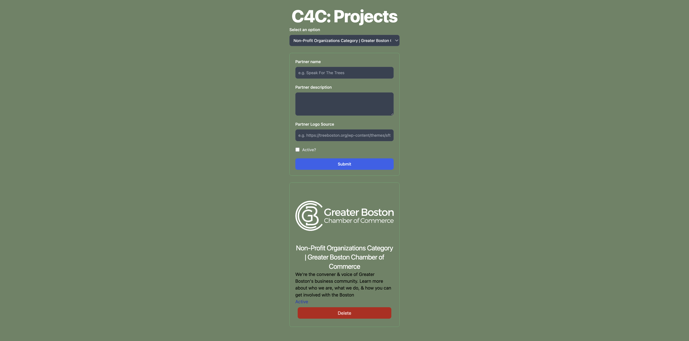

# c4c_fall_2024_tech_challenge

Live demo link: https://www.youtube.com/watch?v=EvW9FubE__M


## A high-level overview of the application
This web application is a simple CRUD (no update since not told to) application that allows for users (c4c's organizations) to create, read, update, and delete their profile on the website. 

The website uses Vite as a local development server to enable the running of this React program.
The backend is built using Express.js and Firebase to store the data.

Features
1. Read: Select an existing partner to view in the info section
2. Create: Add in the inforamtion into the form to push the data into the Firebase database
3. Delete: In the info section, after selecting an existing partner, delete the partner from the database

## An explanation of any design decisions that you made
1. I chose Vite because it's easy to use and has a fast development server
2. Express.js was a choice because I wanted to try something new after using Django and Flask for a while
3. It was my first time using Firebase but it was quite easy to get started besides the connecting part (always)
4. React was a good choice because of its component structure to make this website modular
5. The overall design of the website was kept to the design given in the prompt (i know i didn't have to i just wanted to keep it simple)
6. Yea the color to match the green non profit caring color

## Data storage solution
I used Firebase to allowfor CRUD (no update since not told to) on the data, here are the API endpoints:
1. POST '/uploadData' - to upload the form information to the database
2. GET '/getPartnerNames' - to get all the partner's names so that I can have them in the dropdown menu
3. GET '/getPartnerInfo' - to get the partner's informations, logo, name, description, active or not
4. GET '/deletePartner' - to delete the partner the user wishes from the databse

By using Firebase and using these endpoints instead of in-memory storage, I was able to check this box: Partner information must be stored in one central place, and all users must be able to see the same information

## How to run the project
1. Clone Git Repository
```
git clone https://github.com/kailinxGitHub/c4c_fall_2024_tech_challenge.git
```

2. cd into the project directory
```
cd c4c_fall_2024_tech_challenge
```

3. Install dependencies
```
npm install
```

4. create .ignore file in the root directory and add the following files:
.env:
```
FB_apiKey: __
FB_authDomain: __
FB_projectId: __
FB_storageBucket: __
FB_messagingSenderId: __
FB_appId: __
FB_measurementId: __
```

c4c-fall-2024-tech-challenge-firebase-adminsdk-7b1s1-f31b4f7da9.json:
```
{
    "type": "service_account",
    "project_id": "",
    "private_key_id": "",
    "private_key": "",
    "client_email": "",
    "client_id": "",
    "auth_uri": "",
    "token_uri": "",
    "auth_provider_x509_cert_url": "",
    "client_x509_cert_url": "",
    "universe_domain": ""
}
```

5. Run the project

For Vite (frontend):
```
npm run dev
```

For Express (backend):
```
npm start
```

6. Open the browser and go to http://localhost:5173/ to see the web page
7. Use Thunder Client or Postman http://localhost:3000/ to test the restAPI endpoints
 
Be aware there exists an .env and a firebase config file that's ignored by the repo for privacy reasons.

## Reflection
Did you learn anything from this project? If so, how might you have done this differently knowing what you know now?
I learned a lot about Firebase and how to use CRUD with it. I was previously very comfortable and familiar with CRUD operation with  Flasj, Django, SQL databases, etc. And using the concepts and techniques I learned from this languages, frameworks, and environment I was able to apply it onto firebase pretty easily.

What would you have done differently if you had more time?
I would have designed the website to be prettier, even though I am not really good at design. I would have also added more comments and features to make the code make more sense. 

Did you run into issues during this project? If so, how did solve or work around them?
I ran into a lot of issues with Firebase authentication which took me quite literally half of the time compared to I spent on the website (oops) around 3 hours (9 hours in total on the website). Some other problems I ran into was front end related but since react has an amazing community I was able to find the answer on stack overflow, google, and their own doc pretty easily.

If you implemented any bonus features, what made you choose them?
That "Add Partner Info" button was a bit confusing I was not sure what it was for and thought that a selection dropdown menu to choose the project from the database would be more useful. You can see that from my "Select an option" section.

## Checklist
- [x] Users must be able to view partner organizations’ information on the dashboard. At a minimum, the following information should be displayed:
  - [x] Organization’s name
  - [x] Organization’s logo (NOTE: you may simply upload/store images by their URL - you are not required to process file uploads or actually store images anywhere)
  - [x] Description of what the organization does and how we support them
  - [x] If we are currently actively working with them or not
- [x] Users must be able to add and store the above information for a new partner organization
- [x] Users must be able to delete the information for a given partner organization
- [x] Partner information must be stored in one central place, and all users must be able to see the same information
  - [x] For example, if I add a new partner, then someone else viewing the site on a different tab or browser should be able to see the new partner as well
- [x] Include a README.md in the root directory